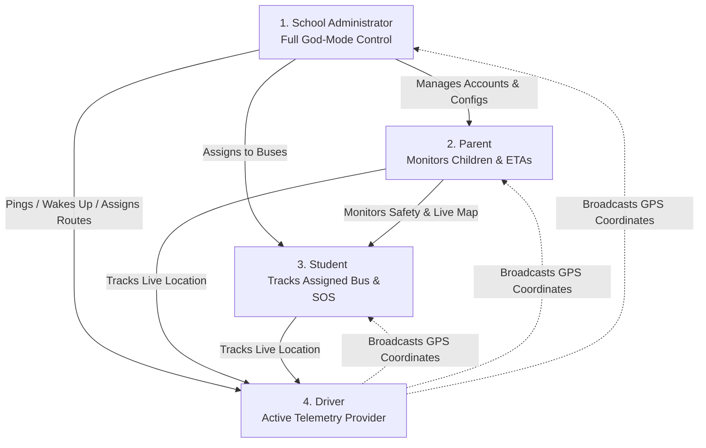

# NaviGuard Technical Architecture & Hierarchical Model

This document outlines the system architecture, technology stack, data flow, and component hierarchy of **NaviGuard** (a real-time school bus tracking and student safety system). Use this guide to explain the technical design and system integration to interviewers.

---

## 1. High-Level Architecture Overview

NaviGuard uses a **Client-Server-Database** architecture with a hybrid deployment model. It combines a **Next.js Web Application** (acting as both frontend and API layer) wrapped inside an **Android Native Shell (Capacitor)** for background tracking, telemetry, and system-level Android features.

```mermaid
graph TD
    %% Clients
    subgraph Client Tier (Mobile & Web)
        Android[Android Native Service <br/> LocationForegroundService.java]
        Capacitor[Capacitor JS Bridge <br/> Custom Plugins]
        ReactUI[React Web App <br/> Dashboards: Admin/Driver/Parent]
    end

    %% Network & Proxy
    subgraph Gateway Tier
        CF[Cloudflare Edge DNS / SSL]
        Nginx[Nginx Reverse Proxy on VPS]
    end

    %% Application Server
    subgraph Server Tier (Docker Container)
        NextJS[Next.js Application <br/> API Routes & Server Actions]
        Middleware[Proxy Middleware <br/> Auth & MFA Guard]
    end

    %% Database Tier
    subgraph Data Tier (Cloud)
        SupaDb[(Supabase PostgreSQL)]
        Realtime[Supabase Realtime <br/> WebSockets]
    end

    %% Connections
    Android -->|Native GPS Coordinates| Capacitor
    Capacitor -->|JSON Data| ReactUI
    ReactUI -->|HTTPS API Requests| CF
    CF -->|Proxy HTTP Port 80| Nginx
    Nginx -->|Proxy Port 5192| NextJS
    NextJS -->|REST / RPC Queries| SupaDb
    ReactUI -->|Direct WebSocket Connection| Realtime
    Realtime <-->|Realtime Pub/Sub| SupaDb
```

---

## 2. Hierarchical System Model

The system is organized into four logical layers. Each layer has specific responsibilities and communicates using strict boundaries:

```
┌──────────────────────────────────────────────────────────┐
│                   1. USER INTERFACE TIER                 │
│  (Next.js App Router + React + TailwindCSS + Leaflet JS) │
│  Dashboards: Admin (Control Room) | Driver | Parent      │
└─────────────┬──────────────────────────────▲─────────────┘
              │ Web Requests                 │ WebSockets (Realtime)
              ▼                              │
┌────────────────────────────────────────────┴─────────────┐
│                    2. APPLICATION TIER                   │
│   (Next.js API Routes, Server Actions, Middleware/MFA)   │
│   Runs in Docker Container | Port: 5192 | Reverse Nginx │
└─────────────┬──────────────────────────────▲─────────────┘
              │ Database Queries             │ Trigger Events
              ▼                              │
┌────────────────────────────────────────────┴─────────────┐
│                       3. DATA TIER                       │
│    (Supabase PostgreSQL + Realtime Engine + RLS Policy)  │
│    Stores tracking, rosters, users, routes, audit logs   │
└──────────────────────────────────────────────────────────┘
                              ▲
                              │ Location Upload (REST API)
┌─────────────────────────────┴────────────────────────────┐
│                  4. NATIVE TELEMETRY TIER                │
│    (Android Native Java Wrapper + Capacitor Plugins)    │
│    Foreground Service | AlarmManager | Screen Wake-Up    │
└──────────────────────────────────────────────────────────┘
```

### Layer Breakdown

#### A. Native Telemetry Tier (Android Native Layer)
*   **LocationForegroundService (Java):** A background service running with high-priority foreground notification to bypass Android's Doze mode. It reads GPS coordinates every 3 seconds.
*   **LocationReceiver & TripStatusReceiver (Java):** Periodically polls the server status via `AlarmManager` and triggers Picture-in-Picture (PiP) mode transitions.
*   **App Wake-Up:** Listens to admin pings via `open_app_requested_at` database polling to wake up the screen and launch the driver app automatically.

#### B. User Interface Tier (Frontend Client)
*   **Admin Dashboard:** Maps out active routes, displays moving buses using Leaflet JS, handles management lists (Buses, Routes, Drivers, Students, Parents), and reviews audit trails.
*   **Driver Portal:** One-tap controls for drivers to start/end trips. Relies on the Capacitor bridge to control the native background tracking service.
*   **Parent Portal:** Shows real-time ETAs, school bus progress, and lists children. Allows the parent to raise SOS alarms.
*   **Student Portal:** Simple mobile layout showing their active route and an emergency SOS button.

#### C. Application Tier (Server Logic)
*   **Route Handling:** Next.js App Router serves standard page routing and backend APIs (e.g., `/api/driver/location` to validate GPS packets and check route deviations).
*   **Custom Middleware (proxy.ts):** Evaluates sessions and redirects unauthenticated or MFA-pending users to login pages.
*   **Containerization:** Packaged inside Docker Compose, running the Next.js standalone build on port `5192` behind an Nginx reverse proxy.

#### D. Data Tier (Supabase Cloud Database)
*   **PostgreSQL:** Relational schemas storing coordinates, logs, routes, and relations.
*   **Supabase Realtime:** Uses database replication triggers to broadcast database changes (like active coordinate updates in `bus_locations`) via WebSockets to listening clients instantly.
*   **Row-Level Security (RLS):** Secures parent and student records so users can only view their own associated telemetry and profile data.

---

## 3. Core Technical Workflows (For Interview Explanations)

Here are the step-by-step workflows for the key features of NaviGuard:

### Workflow A: Real-Time Telemetry & Tracking
1.  **Generation:** The driver taps "Start Trip" on the React UI.
2.  **Bridge:** Capacitor triggers the native Android Java `LocationForegroundService`.
3.  **GPS Capture:** The Android service locks onto the hardware GPS, capturing latitude/longitude every 3 seconds.
4.  **Upload:** The native service sends a HTTP POST request to the Next.js API `/api/driver/location` containing the token, coordinates, speed, and accuracy.
5.  **Ingestion:** The Next.js API parses the packet, validates the session, updates the single row in the `bus_locations` table, and logs audit events if the bus deviates from its predefined route.
6.  **Broadcast:** Supabase detects the row update, pushes the changed row to the Realtime Engine, which pushes it over WebSockets to all connected Admin, Parent, and Student Leaflet Maps.

### Workflow B: Remote Screen Wake-Up (Admin-to-Driver Ping)
1.  **Trigger:** Admin clicks "📲 Open App" next to a inactive driver/bus.
2.  **Update:** Server Action updates `open_app_requested_at` timestamp in the database.
3.  **Poll:** The background Android Receiver (`TripStatusReceiver`) polls the database.
4.  **Wake-Up:** Upon seeing a new timestamp, Java runs:
    ```java
    PowerManager pm = (PowerManager) context.getSystemService(Context.POWER_SERVICE);
    WakeLock wl = pm.newWakeLock(PowerManager.SCREEN_BRIGHT_WAKE_LOCK | PowerManager.ACQUIRE_CAUSES_WAKEUP, "NaviGuard::Wakeup");
    wl.acquire(3000);
    ```
    This turns the screen on, bypasses lock screens (if permitted), and launches the driver application.

---

## 4. Key Architectural Highlights & Engineering Decisions

| Feature / Design | Technical Solution | Why it matters |
| :--- | :--- | :--- |
| **Bypassing Battery Saver** | High-Priority Foreground Notification + `debug.keystore` whitelist requests | Prevents Android OS from killing the GPS tracking process when the screen is turned off or when the app goes into the background. |
| **Realtime performance** | Supabase WebSockets (Pub/Sub) | Bypasses traditional REST polling. Reduces database load by 90% and provides sub-second latency updates on client maps. |
| **High Availability** | Nginx Proxy + Cloudflare SSL (Flexible Mode) | Cloudflare acts as the SSL edge and shields the host IP, while Nginx forwards traffic locally to Next.js running in a Docker container on port `5192`. |
| **Clean Deployments** | GitHub Actions CI/CD | Push-to-deploy automatically compiles Next.js production builds on the server and builds release APKs on GitHub's free runners. |
| **Robust Versioning** | Proper Semantic Version Matching (`compareVersions`) | Prevents outdated Android client versions from transmitting bad data by prompting users for in-app updates automatically. |

---

## 5. Technology Stack Summary

*   **Frontend UI:** React (Next.js App Router), TailwindCSS, Leaflet JS (OpenStreetMap Tiles).
*   **Hybrid Bridge:** Capacitor JS + Custom Native Android Java Plugins.
*   **Backend Server:** Next.js Server Actions & API routes.
*   **Database:** Supabase (PostgreSQL, Realtime WebSocket Server, GoTrue Auth).
*   **Proxy & Hosting:** Cloudflare (DNS/SSL Edge) + Nginx (Reverse Proxy) + Docker.
*   **CI/CD Pipeline:** GitHub Actions.

---

## 6. User Role Hierarchy & Live Tracking Model

NaviGuard uses a top-down hierarchical model for system roles and tracking permissions. The primary monitored entity is the **Driver**, whose telemetry data flows upwards to satisfy the monitoring needs of the other tiers.



### Role-Based Permissions & Tracking Scope:

1. **School Administrator (Top of Hierarchy):**
   * **Scope:** God-mode permissions.
   * **Capabilities:** Full management of all accounts, buses, drivers, routes, and student-to-bus assignments. 
   * **Tracking Access:** Can view all active buses, routes, and logs simultaneously on a master map. Can send remote "Open App" wake-up requests to any driver.

2. **Parent (Mid-Level Hierarchy):**
   * **Scope:** Family safety view.
   * **Capabilities:** Views profile details of assigned children, historical SOS events, and announcements.
   * **Tracking Access:** Can track **only** the specific bus(es) currently assigned to their children. Row-Level Security (RLS) protects other buses/routes from being viewed.

3. **Student (Base-Level Hierarchy):**
   * **Scope:** Personal transit portal.
   * **Capabilities:** View personal bus stops, active announcements, and trigger emergency SOS alarms.
   * **Tracking Access:** Can track **only** their own active assigned bus.

4. **Driver (The Monitored Data Source):**
   * **Scope:** Active transit execution.
   * **Capabilities:** No access to student or parent accounts. Responsible solely for starting/ending trips and feeding coordinates into the system.
   * **Tracking Access:** Does not track anyone. Instead, **the Admin, Parents, and Students all track the Driver** in real-time when the driver starts a trip.

