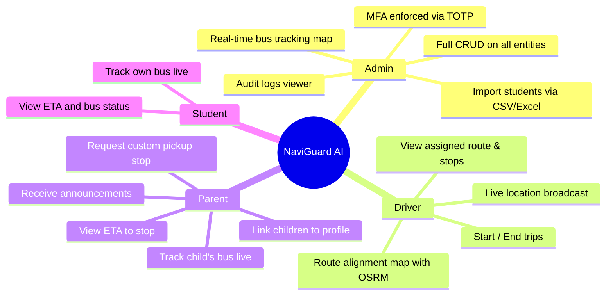

# 🗺️ NaviGuard AI — Complete App Mind Map

> **Purpose**: Full system overview for continuing development with any AI assistant (GPT, Gemini, etc.)  
> **Stack**: Next.js 15 (App Router) · Supabase (PostgreSQL + Auth + Realtime) · Leaflet · TypeScript

---

## 🏗️ Project Structure

```
d:\navigation system\
├── app/                        # Next.js App Router pages & API
│   ├── (admin)/                # Admin-only MFA setup page
│   ├── (auth)/login/           # Login + MFA Challenge pages
│   ├── dashboard/              # Main dashboard (role-aware)
│   ├── api/                    # Backend REST API routes
│   └── page.tsx                # Root redirect → /dashboard
├── components/                 # Shared UI components
│   ├── dashboard/              # Role-specific dashboard views
│   │   └── subviews/           # Feature subpages per role
│   ├── LiveMap.tsx             # Leaflet + OSRM real-time map
│   ├── AdminMap.tsx            # Admin-side bus tracking map
│   ├── BottomNav.tsx           # Mobile bottom navigation bar
│   └── Sidebar.tsx             # Desktop sidebar navigation
├── lib/                        # Shared utilities & services
│   ├── supabase/               # Supabase client instances
│   ├── gemini-optimizer.ts     # Gemini AI TSP route optimizer
│   ├── eta.ts                  # ETA calculation utilities
│   ├── import-service.ts       # CSV/Excel bulk import logic
│   ├── validations.ts          # Zod schema validators
│   ├── auth-guard.ts           # Server-side role auth helpers
│   └── utils.ts                # Shared utility functions
├── proxy.ts                    # Next.js middleware (auth + MFA)
└── .env.local                  # Supabase URL, keys, JWT secret
```

---

## 👥 User Roles & Access



---

## 🗄️ Database Tables (Supabase / PostgreSQL)

| Table | Description | Key Columns |
|---|---|---|
| `user_profiles` | All users | `id`, `full_name`, `role` (`admin`/`driver`/`parent`/`student`) |
| `schools` | School entities | `id`, `name`, `address`, `contact_email` |
| `buses` | Bus fleet | `id`, `name`, `registration_plate`, `school_id`, `capacity` |
| `drivers` | Driver profiles | `id`, `user_id`, `school_id`, `bus_id`, `license_number`, `is_active` |
| `routes` | Named bus routes | `id`, `name`, `school_id`, `bus_id` |
| `stops` | Individual stops | `id`, `route_id`, `name`, `address`, `latitude`, `longitude`, `stop_order` |
| `student_profiles` | Student profiles | `id`, `user_id`, `school_id`, `bus_id`, `stop_id` |
| `parent_student_links` | Parent↔Student links | `id`, `parent_user_id`, `student_id` |
| `active_trips` | Live trip sessions | `id`, `bus_id`, `driver_id`, `route_id`, `status` (`active`/`completed`) |
| `bus_locations` | Real-time GPS pings | `id`, `bus_id`, `trip_id`, `latitude`, `longitude`, `timestamp` |
| `announcements` | Push notifications | `id`, `school_id`, `bus_id`, `title`, `body`, `created_at` |
| `driver_assignments` | Driver↔Route links | `id`, `driver_id`, `route_id`, `is_active` |
| `audit_logs` | Admin activity log | `id`, `user_id`, `action`, `entity`, `created_at` |

> **RLS Policy Note**: All tables have Row Level Security enabled.  
> Server-side admin operations use `adminClient` (service role key) to bypass RLS.  
> Custom JWT claims (`school_id()`, `role()`) are used in some policies.

---

## 🔌 API Routes

### Admin APIs (`/api/admin/...`)
| Endpoint | Method | Purpose |
|---|---|---|
| `/api/admin/dashboard` | GET | Aggregated stats (buses, drivers, students, routes) |
| `/api/admin/buses` | GET, POST | List / create buses |
| `/api/admin/buses/[id]` | PATCH, DELETE | Update / delete a bus |
| `/api/admin/drivers` | GET, POST | List / create drivers |
| `/api/admin/drivers/[id]` | PATCH, DELETE | Update / delete a driver |
| `/api/admin/students` | GET, POST | List / create students |
| `/api/admin/students/[id]` | PATCH, DELETE | Update / delete a student |
| `/api/admin/parents` | GET, POST | List / create parents |
| `/api/admin/routes` | GET, POST | List / create routes (auto-optimizes stop order via Gemini AI) |
| `/api/admin/routes/[id]` | GET, PATCH, DELETE | Get / update / delete route (re-optimizes on PATCH) |
| `/api/admin/stops` | POST | Add stop to a route (auto-resolves `stop_order` collisions) |
| `/api/admin/stops/[id]` | PATCH, DELETE | Update / delete a stop |
| `/api/admin/assignments` | GET, POST | List / create driver-route assignments |
| `/api/admin/import` | POST | Bulk import students/routes from CSV/Excel |
| `/api/admin/audit-logs` | GET | Fetch audit log entries |

### Driver APIs (`/api/driver/...`)
| Endpoint | Method | Purpose |
|---|---|---|
| `/api/driver/assignment` | GET | Fetch driver's assigned bus, route, stops + school coords |
| `/api/driver/location` | POST | Broadcast GPS ping → triggers geofence + de-boarding logic |
| `/api/driver/trip/start` | POST | Create active trip session |
| `/api/driver/trip/end` | POST | Mark trip as completed |

### Parent APIs (`/api/parent/...`)
| Endpoint | Method | Purpose |
|---|---|---|
| `/api/parent/track` | GET | Get live bus location + ETA for child's stop |
| `/api/parent/children` | GET, POST | List / link children to parent profile |
| `/api/parent/request-stop` | POST | Request a custom pickup stop on a route |
| `/api/parent/announcements` | GET | Get announcements for parent's school |

### Student APIs (`/api/student/...`)
| Endpoint | Method | Purpose |
|---|---|---|
| `/api/student/track` | GET | Get live bus + ETA for student |

### Shared APIs
| Endpoint | Method | Purpose |
|---|---|---|
| `/api/tracking/[busId]` | GET | Public bus tracking by bus ID |
| `/api/resolve-map-link` | GET | Decode Google Maps / short URLs → lat/lng coords |
| `/api/auth/...` | — | Supabase auth handlers (login, logout, callback) |

---

## 🖥️ UI Components & Pages

### Dashboard Views (Role-Gated)
```
/dashboard → role-aware redirect
├── AdminDashboardView.tsx      → Stats cards + subview navigation
├── DriverDashboardView.tsx     → Route map + trip controls
├── ParentDashboardView.tsx     → Bus tracker + child management
└── StudentDashboardView.tsx    → Personal bus tracker
```

### Admin Subviews (`components/dashboard/subviews/`)
| Component | Purpose |
|---|---|
| `RoutesView.tsx` | Create/edit routes, add stops (Google Maps URL decoder built-in) |
| `DriversView.tsx` | CRUD drivers, assign to buses |
| `BusesView.tsx` | CRUD buses |
| `StudentsView.tsx` | CRUD students, assign to stops/buses |
| `ParentsView.tsx` | CRUD parents, link to children |
| `AssignmentsView.tsx` | Assign drivers to routes |
| `ImportView.tsx` | Bulk CSV/Excel import wizard |
| `AuditLogsView.tsx` | Activity logs table |

### Driver Subviews
| Component | Purpose |
|---|---|
| `DriverRouteView.tsx` | Interactive stop sequence list + Leaflet map with OSRM routing |
| `DriverTripView.tsx` | Active trip controls — start/end trip, mark student de-boardings |

### Parent/Student Subviews
| Component | Purpose |
|---|---|
| `ParentTrackView.tsx` | Live bus map + ETA for parent |
| `ParentAnnouncementsView.tsx` | Push notification feed |
| `StudentTrackView.tsx` | Live bus map for student |

### Shared Components
| Component | Purpose |
|---|---|
| `LiveMap.tsx` | Leaflet map — shows stops, live bus marker, OSRM road routing, real-time updates via Supabase Realtime |
| `AdminMap.tsx` | Admin-only map for tracking all active buses |
| `BottomNav.tsx` | Mobile tab navigation bar |
| `Sidebar.tsx` | Desktop sidebar navigation |
| `Badge.tsx` | Status badge pill component |

---

## ⚙️ Key Business Logic

### 🗺️ Route Optimization (Gemini AI + TSP Fallback)
- **File**: `lib/gemini-optimizer.ts`
- **Trigger**: Every time a route is created (`POST /api/admin/routes`) or updated (`PATCH /api/admin/routes/[id]`)
- **Primary**: Calls `gemini-2.5-flash` API with stop names/coords → asks AI to return optimal visit order
- **Fallback**: Local Nearest-Neighbor TSP algorithm if Gemini key is missing or times out
- **Env var needed**: `GEMINI_API_KEY` in `.env.local`

### 📍 Live Location Tracking
- **File**: `app/api/driver/location/route.ts`
- **Flow**: Driver app POSTs GPS coords → saved to `bus_locations` table → Supabase Realtime broadcasts to all subscribed parent/student clients → `LiveMap.tsx` updates bus marker position

### 🚨 Geofencing — Route Deviation Alert
- **Trigger**: When driver GPS ping is >500m away from the expected next stop
- **Action**: Creates an `announcement` with title `⚠️ Route Deviation Alert` visible to admin and parents

### 📢 Student De-boarding Alert
- **Trigger**: Driver marks a stop as completed in `DriverTripView`
- **Action**: Creates an `announcement` with title `📢 Student De-boarded` for each student at that stop

### 🗺️ Google Maps URL Decoder
- **File**: `app/api/resolve-map-link/route.ts`
- **Purpose**: Accepts standard or shortened Google Maps URLs, resolves to lat/lng
- **Used in**: Route stop creation modals (admin), parent stop request modal

### 🔐 Authentication & MFA
- **File**: `proxy.ts` (Next.js Middleware)
- **Admin MFA**: Enforced via Supabase TOTP MFA
  - No factor enrolled → redirect to `/admin/mfa-setup`
  - Factor enrolled but session not elevated → redirect to `/login/mfa-challenge`
- **Role detection**: From Supabase session JWT custom claims (`role`, `school_id`)

### 🚌 School Campus as Route Start Point
- **File**: `app/api/driver/assignment/route.ts`
- **Logic**: Returns `school: { name, latitude, longitude }` alongside stops
- **File**: `components/dashboard/subviews/DriverRouteView.tsx`
- **Logic**: Prepends `🏫 School Campus` as `stop_order: 0` to all stops so Leaflet can draw a complete route line from school → stops

### 🛣️ OSRM Road Routing
- **File**: `components/LiveMap.tsx`
- **API**: `https://router.project-osrm.org/route/v1/driving/{coords}?overview=full&geometries=geojson`
- **Behavior**: Fetches real driving path geometry → draws as indigo polyline on Leaflet map
- **Fallback**: Straight-line dashed polyline if OSRM fails
- **Guard**: `destroyed` flag prevents async callbacks from crashing on unmounted maps

---

## 🔧 Environment Variables (`.env.local`)

```env
# Public (exposed to browser)
NEXT_PUBLIC_SUPABASE_URL=https://qnhyozxzskhnncgoplfb.supabase.co
NEXT_PUBLIC_SUPABASE_ANON_KEY=eyJ...
NEXT_PUBLIC_APP_URL=http://localhost:3000

# Private (server-side only)
SUPABASE_SERVICE_ROLE_KEY=eyJ...
SUPABASE_JWT_SECRET=smYwm...

# Optional AI features
GEMINI_API_KEY=<your-key-here>
```

---

## 🧩 Tech Stack Summary

| Layer | Technology |
|---|---|
| **Framework** | Next.js 15 (App Router, TypeScript) |
| **Database** | Supabase (PostgreSQL) |
| **Auth** | Supabase Auth (JWT + TOTP MFA) |
| **Realtime** | Supabase Realtime (WebSocket channels) |
| **Maps** | Leaflet.js + OpenStreetMap tiles |
| **Road Routing** | OSRM (Open Source Routing Machine) — free, no key needed |
| **AI Optimizer** | Google Gemini 2.5 Flash API (optional, with TSP fallback) |
| **Validation** | Zod |
| **Styling** | Tailwind CSS |
| **State** | TanStack Query (React Query) |
| **Data Import** | CSV / Excel parsing via `import-service.ts` |

---

## 🚦 App Flow Summary

```
User logs in → Supabase Auth
    ↓
Middleware (proxy.ts) checks role + MFA
    ↓
/dashboard → Role-based view rendered
    ↓
┌─────────────┬─────────────┬─────────────────┐
│   Admin     │   Driver    │  Parent/Student  │
│ Manage all  │ Start trip  │  Track bus live  │
│ entities    │ Broadcast   │  Get ETA         │
│ View map    │ GPS pings   │  Announcements   │
└─────────────┴─────────────┴─────────────────┘
                   ↓
    GPS ping → /api/driver/location
       → Save to bus_locations
       → Supabase Realtime broadcast
       → Parents/Students see live map update
       → Geofence check (500m deviation alert)
       → De-boarding check (student announcements)
```

---

## 📝 Known Issues & Fixes Applied

| Issue | Fix Applied |
|---|---|
| Onboarding password validation failed | Relaxed `.length(8)` → `.min(8)` in `validations.ts` |
| Trip start/end 500 error (RLS) | Switched to `adminClient` in trip start/end routes |
| Stops `stop_order` unique collision | Auto-resolve with `maxOrder + 1` in stops API |
| No route line with 1 stop | Prepend school as Stop 0 → always ≥2 points for polyline |
| OSRM callback crash on unmount | Added `destroyed` flag guard in `LiveMap.tsx` useEffect |
| Parent-student link not saved | Added real POST `/api/parent/children` endpoint |
| School has no lat/lng DB columns | Hardcoded default coords `27.5609, 76.6111` in assignment API |

---

> **School Default Coordinates**: Lat `27.5609`, Lng `76.6111` (Sunrise Public School, Sector 5, Jaipur, Rajasthan)  
> **School ID**: `a0000000-0000-0000-0000-000000000001`  
> **Supabase Project**: `qnhyozxzskhnncgoplfb`
